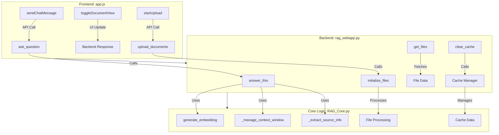

# Method Interaction Diagram

## Overview
This diagram illustrates the interaction between the frontend (`app.js`), backend (`rag_webapp.py`), and core logic (`RAG_Core.py`) in the Retrieval-Augmented Generation (RAG) system.

## Explanation
1. **Frontend (`app.js`)**:
   - Handles user interactions and sends API requests to the backend.
   - Updates the UI based on responses from the backend.

2. **Backend (`rag_webapp.py`)**:
   - Exposes API endpoints for the frontend.
   - Interacts with the core logic in `RAG_Core.py` to process requests.

3. **Core Logic (`RAG_Core.py`)**:
   - Implements the main functionality of the RAG system, including embedding generation, context management, and file processing.

## Key Interactions
- `sendChatMessage` in `app.js` calls `ask_question` in `rag_webapp.py`, which invokes `answer_this` in `RAG_Core.py`.
- `startUpload` in `app.js` calls `upload_documents` in `rag_webapp.py`, which processes files using `initialize_files` in `RAG_Core.py`.
- Cache management and context optimization are handled internally within `RAG_Core.py`.
